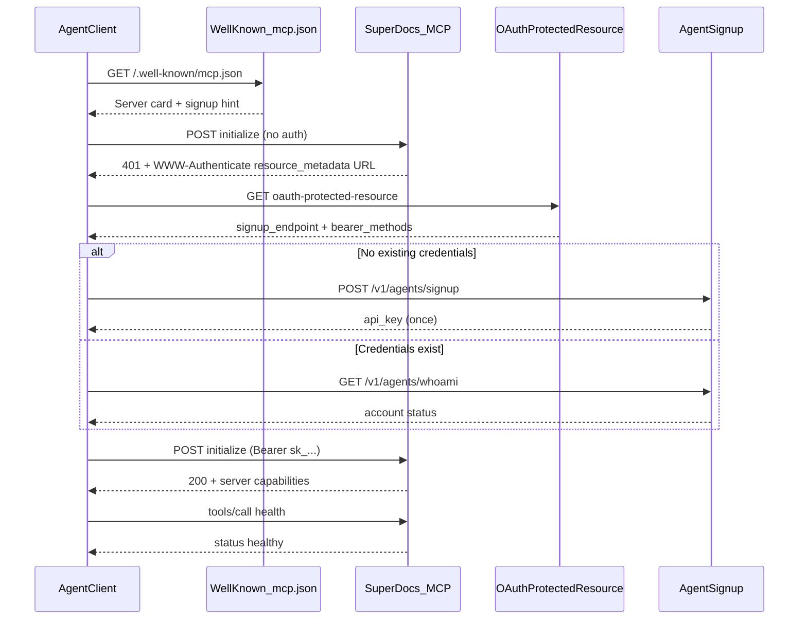

# Authenticated Agent Connection Walkthrough

## Goal

Deliver a **working Python client** plus a **step-by-step walkthrough README** that shows how an MCP agent client discovers SuperDocs, learns how to authenticate, obtains credentials, and completes an authenticated connection. This matches the assigned build card: *"a real client completes the flow end to end and the walkthrough explains each step for someone implementing it."*

## What SuperDocs actually implements

SuperDocs follows the MCP authorization discovery spec (RFC 9728 Protected Resource Metadata) but uses **Bearer API keys** rather than a full OAuth authorization-server flow. Verified live against production:

| Step | Endpoint / behavior | Purpose |
|------|---------------------|---------|
| 1. Server card | `GET https://api.superdocs.app/.well-known/mcp.json` | MCP registry discovery; exposes endpoint, required `Authorization` header, and `_meta.signup_endpoint` |
| 2. Unauthenticated probe | `POST https://api.superdocs.app/mcp/` (MCP `initialize`) | Returns **401** with `WWW-Authenticate: Bearer ... resource_metadata="https://api.superdocs.app/mcp/.well-known/oauth-protected-resource"` |
| 3. Resource metadata | `GET .../mcp/.well-known/oauth-protected-resource` | RFC 9728 document: `resource`, `bearer_methods_supported`, `signup_endpoint`, docs links |
| 4. Credential acquisition | `POST https://api.superdocs.app/v1/agents/signup` | Agent self-signup; returns one-time `api_key` (or reuse via `GET /v1/agents/whoami`) |
| 5. Authenticated MCP | Same `/mcp/` with `Authorization: Bearer sk_...` | `initialize` → `notifications/initialized` → `tools/call` (`health`, `get_account_status`) |

Note: `oauth-authorization-server` and `openid-configuration` return **404** on SuperDocs — there is no OAuth AS. The walkthrough must explain this clearly: metadata discovery is standards-based; credential acquisition is agent signup + Bearer token (documented at [Agent signup](https://docs.superdocs.app/introduction/agent-signup)).



## Project location and layout

Per [CONTRIBUTING.md](CONTRIBUTING.md) and [extensions/README.md](extensions/README.md):

```
extensions/Shreyaskulkarni56/agent-connection-walkthrough/
├── README.md              # Walkthrough (primary deliverable for reviewers)
├── connect.py             # Runnable end-to-end client
├── requirements.txt       # httpx only
└── .env.example           # SUPERDOCS_API_KEY=your-key-here (optional skip-signup)
```

No changes outside this folder.

## Implementation: `connect.py`

Single Python script (~200–250 lines) with structured step output. Uses **raw HTTP** (not the MCP SDK) so each protocol layer is visible — ideal for a walkthrough.

### CLI flags

- `--agent-name NAME` — passed to signup (default: `connection-walkthrough-demo`)
- `--discover-only` — run steps 1–3 only; no signup or MCP calls (safe for dry runs)
- `--skip-signup` — use `SUPERDOCS_API_KEY` env var or `~/.superdocs/agent_credentials.json`
- `--verbose` — print full JSON responses

### Step functions (each prints a labeled banner + explanation)

1. **`discover_server_card()`** — fetch `/.well-known/mcp.json`; extract remote URL and auth header requirements
2. **`probe_unauthenticated()`** — POST MCP `initialize`; parse `WWW-Authenticate` header for `resource_metadata` URL (regex on `resource_metadata="..."`)
3. **`fetch_resource_metadata(url)`** — GET metadata; extract `signup_endpoint`
4. **`load_or_acquire_credentials(signup_endpoint)`**:
   - Check `~/.superdocs/agent_credentials.json` first (per [agent signup docs](https://docs.superdocs.app/introduction/agent-signup))
   - If present, validate with `GET /v1/agents/whoami`
   - Else POST signup with `{"terms_accepted": true, "agent_name": ...}`; save response to credentials file (mask key in stdout)
5. **`connect_mcp(api_key)`** — authenticated Streamable HTTP sequence:
   - POST `initialize` with `Accept: application/json, text/event-stream`
   - POST `notifications/initialized`
   - POST `tools/list` (prove tool discovery)
   - POST `tools/call` for `health` and `get_account_status`
6. **`print_summary()`** — recap of what succeeded and copy-paste MCP config snippet (with placeholder key)

### Error handling (minimal, instructional)

- 401 on probe → expected; continue to metadata
- Signup failure → clear message (e.g. rate limit)
- MCP failure after auth → show status code and `detail` field

### Budget / safety (per task guidance)

- Default agent name is fixed; no loops
- `--discover-only` for zero-account runs
- Reuse credentials file to avoid repeated signups during development

## Implementation: `README.md`

Structured as an implementer's guide, not just install instructions:

1. **What this demonstrates** — one paragraph + mermaid diagram (same as above)
2. **Prerequisites** — Python 3.10+, `pip install -r requirements.txt`
3. **Quick run** — three commands: discover-only, full flow, skip-signup with existing key
4. **Step-by-step walkthrough** — one section per step:
   - What the client does
   - The HTTP request/response (example snippets from live API)
   - Why it matters (link to MCP spec section / RFC 9728 / SuperDocs docs)
   - What SuperDocs-specific twist applies (e.g. signup instead of OAuth AS)
5. **Sample terminal output** — annotated excerpt from a successful run
6. **Implementing this in your own agent** — checklist mapping steps to code
7. **SuperDocs features used** — MCP, agent signup, `health`, `get_account_status`
8. **Troubleshooting** — 401 meanings, credential reuse, `--discover-only`

Key live examples to embed (already verified):

**401 probe response header:**
```
www-authenticate: Bearer realm="OAuth", resource_metadata="https://api.superdocs.app/mcp/.well-known/oauth-protected-resource", ...
```

**Resource metadata body:**
```json
{
  "resource": "https://api.superdocs.app/mcp",
  "bearer_methods_supported": ["header"],
  "signup_endpoint": "https://api.superdocs.app/v1/agents/signup"
}
```

## PR checklist

- Folder: [`extensions/Shreyaskulkarni56/agent-connection-walkthrough/`](extensions/Shreyaskulkarni56/agent-connection-walkthrough/)
- PR description includes builder name + 1–2 sentence summary (per CONTRIBUTING)
- No secrets committed; `.env.example` uses placeholders only
- Run locally before PR: `python connect.py --discover-only` and one full `--skip-signup` run if you have a test key

## Out of scope (intentionally)

- Full document editing demo (upload/chat/approve/export) — assigned build is **connection** only; README can mention those four calls as the natural next step after auth
- OAuth PKCE flow — not supported by SuperDocs today; document the 404 on AS metadata endpoints
- TypeScript variant — user chose Python only

## Verification plan

1. `python connect.py --discover-only` — completes without creating an account
2. `python connect.py` — full signup + MCP health + account status (one-time account creation)
3. Re-run with saved credentials — reuses account via whoami, no second signup
4. Confirm README steps match actual script output line-for-line
